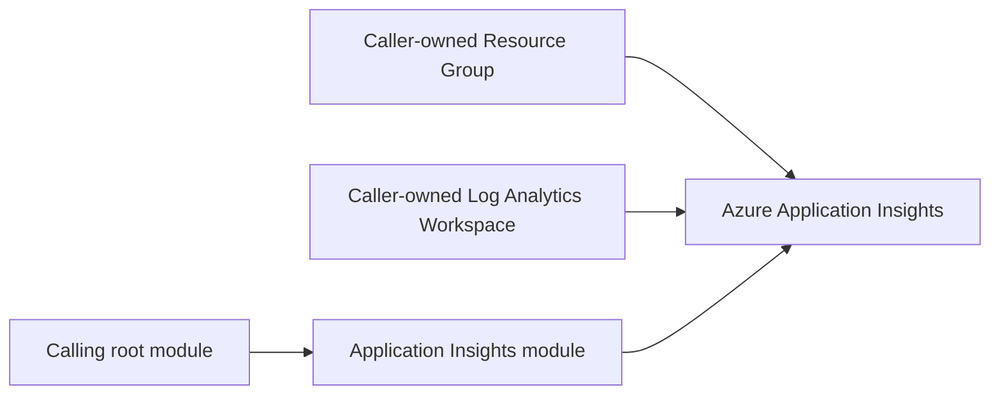

# Terraform Module: Azure Application Insights

Provisions an [Azure Application Insights](https://registry.terraform.io/providers/hashicorp/azurerm/latest/docs/resources/application_insights) instance against a caller-supplied [Log Analytics workspace](https://registry.terraform.io/providers/hashicorp/azurerm/latest/docs/resources/log_analytics_workspace).

The workspace is owned by the caller rather than this module, so one workspace can back several Application Insights instances and its lifecycle stays independent of them.

## Dependency Graph



## Usage

```hcl
module "appinsights" {
  source              = "git::https://github.com/f2calv/tf_module_azurerm_application_insights.git//src?ref=0.3.2"
  resource_group_name = azurerm_resource_group.rg.name
  location            = azurerm_resource_group.rg.location
  appinsights_name    = "my-app-insights"
  workspace_id        = azurerm_log_analytics_workspace.this.id
  tags                = { environment = "dev" }
}
```

The resource group and Log Analytics workspace in this example are created by
the calling root module and are not managed by this module.

<!-- markdownlint-disable MD060 -->
<!-- BEGIN_TF_DOCS -->
## Requirements

| Name | Version |
| ---- | ------- |
| terraform | >= 1.0 |
| azurerm | >= 5.0, < 6.0 |

## Providers

| Name | Version |
| ---- | ------- |
| azurerm | >= 5.0, < 6.0 |

## Resources

| Name | Type |
| ---- | ---- |
| [azurerm_application_insights.this](https://registry.terraform.io/providers/hashicorp/azurerm/latest/docs/resources/application_insights) | resource |

## Inputs

| Name | Description | Type | Default | Required |
| ---- | ----------- | ---- | ------- | :------: |
| appinsights\_name | Name of the Application Insights instance. | `string` | n/a | yes |
| resource\_group\_name | Name of the parent resource group. | `string` | n/a | yes |
| workspace\_id | Resource ID of the Log Analytics workspace backing this instance. | `string` | n/a | yes |
| daily\_data\_cap\_in\_gb | Daily data volume cap in GB. | `number` | `1` | no |
| location | Location of the parent resource group. | `string` | `"West Europe"` | no |
| retention\_in\_days | Retention period in days for Application Insights. | `number` | `30` | no |
| tags | Any tags that should be present on the resources. | `map(string)` | `{}` | no |

## Outputs

| Name | Description |
| ---- | ----------- |
| app\_id | The App ID associated with the Application Insights instance. |
| connection\_string | The connection string of the Application Insights instance. |
| id | The ID of the Application Insights instance. |
| location | The location of the Application Insights instance. |
| name | The name of the Application Insights instance. |
| workspace\_id | The ID of the Log Analytics workspace backing this instance. |
<!-- END_TF_DOCS -->
<!-- markdownlint-enable MD060 -->

## Development

Regenerate the Terraform reference after changing resources, variables,
outputs, or version constraints:

```bash
terraform-docs --config .terraform-docs.yml src
```

The pre-commit configuration runs the same command in CI and fails when
generated documentation is not committed.
